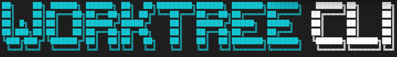

<p align="center">
  
</p>

<p align="center">
  Interactive TUI for managing git worktrees.
</p>

## Features

- List all worktrees with branch and path info
- Create worktrees from existing branches or new branches
- Enforced branch naming convention (`feature/` or `bugfix/` prefixes)
- Delete worktrees with optional branch cleanup
- Wizard-based guided workflows for create/delete operations
- Post-create actions (open terminal, editor, etc.)
- Configurable default worktree storage location
- Automatic file copying to new worktrees (e.g., `.env` files)
- First-run setup wizard
- Arrow key navigation

## Installation

Requires [Bun](https://bun.sh) runtime.

```bash
# Install dependencies
bun install

# Link globally
bun link

# Or run directly
bun run start
```

## Usage

Run `wt` from within a git repository:

```bash
wt
```

### Keyboard Shortcuts

**List View:**
- `↑/↓` - Navigate worktrees
- `c` - Create new worktree
- `d` - Delete selected worktree
- `o` - Open selected worktree (runs post-create command)
- `s` - Open settings
- `r` - Refresh list
- `q` - Quit

**Create Wizard:**
- `↑/↓` - Navigate options
- `Enter` - Confirm selection
- `Esc` - Cancel/Go back

When creating a new branch, the wizard enforces a naming convention:
1. Select branch type: `feature/` or `bugfix/`
2. Enter branch name (e.g., `my-feature`)
3. Final branch name will be `feature/my-feature` or `bugfix/my-feature`

**Delete Wizard:**
- `↑/↓` - Navigate options
- `Enter` - Confirm selection
- `Esc` - Cancel

## Configuration

Config file: `~/.worktree-cli/config.json`

```json
{
  "defaultWorktreePath": "~/.worktree-cli/worktrees/{repo}/{branch}",
  "postCreateCommand": "open -a Terminal {path}",
  "filesToCopy": [".env*"]
}
```

### Options

- `defaultWorktreePath` - Template for worktree location
  - `{repo}` - Repository name
  - `{branch}` - Branch name (slashes replaced with dashes)
- `postCreateCommand` - Command to run after creating a worktree
  - `{path}` - Path to the created worktree
- `filesToCopy` - Glob patterns for files to copy to new worktrees
  - Useful for files not tracked by git (e.g., `.env`, `.env.local`)
  - Supports glob patterns like `.env*`, `config/*.local.json`

## Project Structure

```
src/
├── index.tsx              # Entry point
├── App.tsx                # Main TUI component
├── components/
│   ├── WorktreeList.tsx   # Worktree list display
│   ├── CreateWorktree.tsx # Create worktree wizard
│   ├── DeleteWorktree.tsx # Delete worktree wizard
│   ├── DeleteBranchPrompt.tsx
│   ├── PostCreatePrompt.tsx
│   ├── Settings.tsx       # Settings editor
│   ├── InitialSetup.tsx   # First-run setup wizard
│   ├── Header.tsx
│   ├── StatusBar.tsx
│   └── wizard/            # Reusable wizard components
│       ├── Wizard.tsx
│       ├── SelectionStep.tsx
│       ├── TextInputStep.tsx
│       ├── ConfirmationStep.tsx
│       ├── WizardSummary.tsx
│       └── index.ts
├── hooks/
│   ├── useWorktrees.ts    # Worktree state management
│   └── useWizard.ts       # Wizard flow management
├── types/
│   └── wizard.ts          # Wizard type definitions
└── utils/
    ├── git.ts             # Git command wrappers
    └── config.ts          # Config management
```

## Tech Stack

- [Bun](https://bun.sh) - JavaScript runtime
- [Ink](https://github.com/vadimdemedes/ink) - React for CLI
- [TypeScript](https://www.typescriptlang.org/)
