# Why Git Worktrees? A Guide for AI-Assisted Development

## Introduction

If you've ever found yourself wanting to work on multiple features or bugs simultaneously without constantly switching branches and stashing changes, **git worktrees** are exactly what you need. This document explains what worktrees are, why they're particularly valuable when working with AI coding agents, and how to use them effectively.

## The Problem with Traditional Branch Switching

Imagine this scenario: You're deep into implementing a feature when a critical bug report comes in. With traditional git workflow, you need to:

1. Stash or commit your work-in-progress changes
2. Switch to the main branch
3. Create a new branch for the bugfix
4. Fix the bug
5. Switch back to your feature branch
6. Restore your stashed changes
7. Remember where you left off

```mermaid
sequenceDiagram
    participant Dev as Developer
    participant Repo as Repository
    
    Note over Dev,Repo: Working on Feature A
    Dev->>Repo: git stash
    Dev->>Repo: git checkout main
    Dev->>Repo: git checkout -b bugfix/urgent
    Note over Dev,Repo: Fix the bug
    Dev->>Repo: git checkout feature-a
    Dev->>Repo: git stash pop
    Note over Dev,Repo: ❌ Context lost, stash conflicts possible
```



This is disruptive, error-prone, and breaks your flow.

## Enter Git Worktrees

A **worktree** allows you to have multiple working directories for the same repository, each checked out to a different branch. Think of it as having multiple "copies" of your repository, but they all share the same `.git` directory (history, remotes, config).


### Key Benefits

| Traditional Branching | Worktrees |
|----------------------|-----------|
| One working directory | Multiple working directories |
| Must stash/commit to switch | Switch by changing folders |
| Context switching overhead | Zero context switching |
| One IDE window per task | Multiple IDE windows, each on different branch |

## Why Worktrees Shine with AI Agents

AI coding agents (like GitHub Copilot, Cursor, Claude, etc.) work best when they have a clean, focused workspace. Here's why worktrees are a game-changer:

### 1. Parallel AI Sessions

```mermaid
graph LR
    subgraph "Without Worktrees"
        A1[AI Agent] --> R1[Single Repo]
        Note1[❌ One task at a time]
    end
    
    subgraph "With Worktrees"
        A2[AI Agent 1] --> WT1[Worktree: feature/api]
        A3[AI Agent 2] --> WT2[Worktree: feature/ui]
        A4[AI Agent 3] --> WT3[Worktree: bugfix/auth]
        Note2[✅ Parallel development]
    end
```



You can run **multiple AI agent sessions** simultaneously, each working on a different task in its own worktree. No conflicts, no waiting.

### 2. Clean Context for Each Task

AI agents perform better with focused context. Each worktree provides:
- Clean working directory with only relevant changes
- No stashed changes polluting the state
- Independent `node_modules`, build artifacts, etc.

### 3. Easy Review and Comparison

With worktrees, you can easily:
- Open two IDE windows side-by-side comparing implementations
- Test different approaches to the same problem in parallel
- Let AI work on one approach while you manually try another

## Common Concerns Addressed

### "Does it copy all my files?"

**No!** When you create a worktree, git only creates the working directory structure. Here's what happens:

```mermaid
graph TD
    subgraph "Shared"
        G[.git directory]
        H[Git history]
        R[Remote configuration]
        B[All branches]
    end
    
    subgraph "Created"
        T[Tracked files only]
        TN[Checked out to selected branch]
    end
    
    subgraph "NOT Copied ⚠️"
        U[Untracked files]
        I[.gitignore'd files]
        N[node_modules]
        E[.env files]
        L[.local configs]
    end
```



**Important:** Files in `.gitignore` (like `node_modules`, `.env`, build outputs) are **NOT copied** to the new worktree. This is actually a feature - you get a clean slate, but you'll need to:

1. Run `npm install` / `bun install` in the new worktree
2. Copy over any necessary `.env` files (this CLI tool can automate this!)

### "Can I still commit and push normally?"

**Absolutely!** Each worktree works exactly like a normal git repository for day-to-day operations:

```bash
# In any worktree, standard git commands work perfectly
git add .
git commit -m "feat: add new feature"
git push origin feature/my-feature
```

The only restriction is that **two worktrees cannot have the same branch checked out** simultaneously (which makes sense - it would create conflicts).

```mermaid
sequenceDiagram
    participant WT1 as Worktree: feature/api
    participant Git as Shared .git
    participant Remote as GitHub
    
    WT1->>Git: git commit
    Git->>Git: Store commit in history
    WT1->>Remote: git push
    Remote-->>WT1: ✅ Push successful
    
    Note over WT1,Remote: Works exactly like normal git!
```



### "What about pulling and merging?"

Works exactly as expected:

```bash
# Update your branch with latest changes
git fetch origin
git merge origin/main

# Or rebase
git rebase origin/main
```

## Known Limitations

While worktrees are powerful, there are some edge cases to be aware of:

### 1. Hardcoded Paths in Scripts and Aliases

If you have custom-build scripts, deployment aliases, or automation that uses **hardcoded absolute paths** pointing to your original repository location, they will break when executed from a worktree.

```bash
# ❌ This alias won't work in worktrees
alias deploy="cd ~/projects/my-app && ./scripts/deploy.sh"

# ✅ Use relative paths or dynamic resolution instead
alias deploy="cd \$(git rev-parse --show-toplevel) && ./scripts/deploy.sh"
```

**Common problematic patterns:**

| Pattern | Problem | Solution |
|---------|---------|----------|
| `~/projects/my-app/...` | Fixed path to original repo | Use `$(git rev-parse --show-toplevel)` |
| `$PROJECT_ROOT` env var | Points to original location | Update env var per worktree or use git command |
| IDE run configurations | May store absolute paths | Use relative paths or `${workspaceFolder}` |
| Makefile with absolute paths | Hardcoded directories | Use `$(shell pwd)` or `$(CURDIR)` |

### 2. Shared Git Hooks

Git hooks are stored in `.git/hooks`, which is **shared across all worktrees**. This means:
- Pre-commit hooks run the same way everywhere (usually good)
- Hooks that reference specific paths may fail in worktrees

### 3. Git Submodules

Worktrees and submodules can have complications. When creating a worktree in a repo with submodules, you may need to run:

```bash
git submodule update --init --recursive
```

### 4. IDE/Editor Workspace Settings

Some IDE features may not work seamlessly:
- **Cached paths** in IDE project files might point to the original repo
- **Language server caches** (like TypeScript's `tsconfig.tsbuildinfo`) are per-directory
- **Debug configurations** with absolute paths need adjustment

### 5. Branch Locking

The same branch **cannot be checked out in multiple worktrees** simultaneously. This is by design to prevent conflicts, but can be inconvenient if you forget which worktree has a branch:

```bash
# Check which worktree has a branch
git worktree list
```

### Tips to Avoid Issues

1. **Use relative paths** in all scripts when possible
2. **Use `git rev-parse --show-toplevel`** to dynamically get the repo root
3. **Avoid hardcoded paths** in shell aliases and IDE configurations
4. **Document worktree-specific setup** in your project's README
5. **Test scripts from different directories** before relying on them

## Practical Workflow with AI Agents

Here's a typical workflow using worktrees with AI agents:


## Quick Reference

### Creating a Worktree (Command Line)

```bash
# From existing branch
git worktree add ../my-worktree-folder existing-branch

# Creating new branch
git worktree add -b new-feature ../my-worktree-folder main
```

### Listing Worktrees

```bash
git worktree list
```

### Removing a Worktree

```bash
git worktree remove ../my-worktree-folder
```

### Using This CLI Tool

Just run `wt` and use the interactive interface to:
- **Create** worktrees with automatic path management
- **Delete** worktrees and optionally clean up branches
- **Configure** automatic file copying (for `.env` files, etc.)

## Summary

| Feature | Benefit |
|---------|---------|
| Multiple working directories | Work on several tasks simultaneously |
| Shared git history | No duplication of repository data |
| Independent file states | Clean context for each task |
| Normal git operations | `commit`, `push`, `pull` work as expected |
| Perfect for AI agents | Run multiple AI sessions in parallel |

---

**Ready to try it?** Run `wt` in your repository and create your first worktree! 🚀
